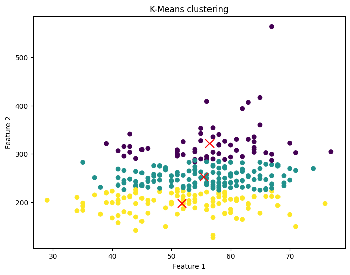

# Machine Learning Project - Results and Visualizations

This document showcases the results and visualizations of different machine learning models applied in this project, along with their respective accuracies.

---

## 1. Decision Tree
The Decision Tree model achieved an accuracy of **100%**. Below is the visualization of the trained Decision Tree:

---

## 2. Support Vector Machine (SVM) - Hard Margin
The Hard Margin SVM was used to classify data that is linearly separable without any errors, providing a clear decision boundary between classes.

---

## 3. Support Vector Machine (SVM) - Soft Margin
The Soft Margin SVM introduces flexibility by allowing some data points to lie on the wrong side of the margin, making it suitable for data with minor overlaps or noise.

---

## 4. K-Means Clustering
K-Means clustering was applied to group data into distinct clusters based on similarity. The visualization below shows the clusters formed and the centroids.

---

## 5. Neural Network
The Neural Network was employed to capture complex relationships in the dataset, achieving an accuracy of **88%**. The network architecture is visualized below:

---

## 6. Random Forest
The Random Forest model, an ensemble of decision trees, provided robust performance with an accuracy of **99%**. Below is a visualization of one of the trees in the Random Forest:

---

### Summary of Accuracies:
- **Decision Tree**: 100%
- **Neural Network**: 88%
- **Random Forest**: 99%

Each model visualization and result demonstrates the effectiveness and differences between various machine learning approaches applied to the dataset in this project.
